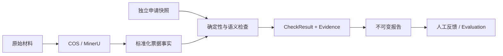

# Finance AI Precheck POC

本项目是一个本地、单人、人工在环的财务预审技术 POC。它把票据接入、结构化事实、确定性检查、受约束语义判断、证据报告和评测实验连接成一条可运行链路。

系统输出用于预审和实验评估，不是 OA 审批、付款指令或真实公司制度结论。仓库中的申请、规则和评测案例均明确标记为 `MOCK`；只有用户显式触发文件接入时才会访问 COS、MinerU 或配置的模型服务。

## 当前能力

- PDF/PNG/JPEG 接入、SHA-256 去重、私有 COS 保存和 MinerU 异步解析。
- 发票字段标准化、字段来源证据和票内确定性检查。
- 独立 Mock 申请与票据事实比较，生成不可变的 `PASS`、`REVIEW` 或 `MISSING_EVIDENCE` 报告。
- 报告详情、追加人工反馈和本地 HTML 导出。
- Evaluation V1：记录 Run、追加人工评价、补正输入后重跑，以及严格金额策略与 Mock 容差策略比较。



## 快速开始

需要 Python 3.11 或更高版本。在仓库根目录执行：

```bash
python3 -m venv .venv
.venv/bin/python -m pip install -r requirements.txt
cp .env.example .env

.venv/bin/streamlit run prototype/streamlit_app.py \
  --server.address 127.0.0.1 \
  --server.port 8501 \
  --browser.gatherUsageStats false
```

Windows 浏览器访问 `http://localhost:8501`。查看已有报告和运行离线评测不需要云服务凭证。

如需接入真实测试材料，必须在本地 `.env` 中显式配置自己的 `COS_BUCKET`、`COS_REGION`、COS 凭证和 `MINERU_TOKEN`。`.env`、运行数据库、上传材料和评测产物均被 Git 忽略。

## 测试

全部回归测试使用临时目录、Fake 服务和合成输入，不访问网络：

```bash
.venv/bin/python -m unittest discover -s prototype/tests
```

当前验收基线通过 99 项测试。GitHub Actions 会对 push 和 pull request 执行同一测试集。

## 仓库结构

| 路径 | 内容 |
|---|---|
| `prototype/` | 应用服务、Streamlit 页面、CLI、迁移、Mock 规则和测试 |
| `prototype/examples/evaluation-v1/` | 受版本管理的合成评测输入与执行配置 |
| `docs/design/` | 接入、预审、产品蓝图和 Evaluation V1 设计 |
| `docs/baseline/` | 已验收工程行为、限制和验证证据 |
| `.specify/assessments/` | 脱敏后的需求发现和财务访谈输入 |

详细操作见 [prototype/README.md](prototype/README.md)，当前验收范围见 [工程基线](docs/baseline/validated-baseline-2026-10-04.md)。

## 安全与数据边界

- 不要提交 `.env`、Token、Secret、签名 URL、真实票据、运行数据库或解析工件。
- 只使用有权处理且已脱敏的测试材料；COS Bucket 应保持私有并使用最小权限凭证。
- `PASS` 只表示当前配置的 POC 检查通过，不证明票据真实、制度合规或报销获批。
- 本项目尚未实现认证、RBAC、生产并发、隐私保留策略、监控告警或 OA 写回。

安全问题处理方式见 [SECURITY.md](SECURITY.md)。

## 许可证

仓库所有者尚未选择公开许可证。在添加 `LICENSE` 前，本仓库不应被描述为开源项目，也不授予复制、修改或再分发许可。
