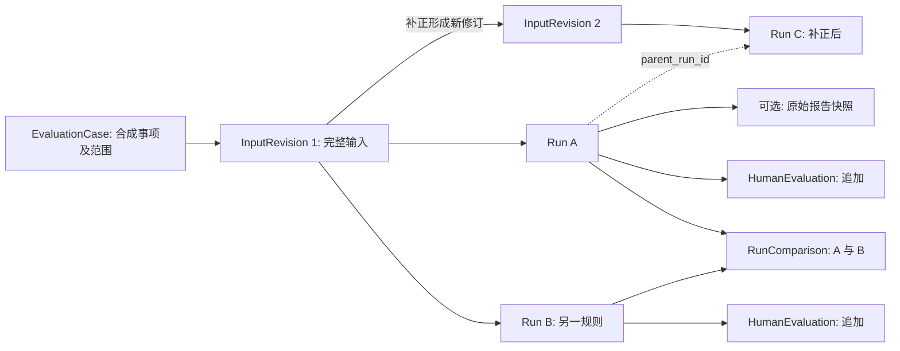

# Evaluation Experiment V1：最小评测与变化实验设计

- 日期：2026-10-02
- 状态：2026-10-03 已按 V1 边界实现；本文件保留设计约定，使用方式见 [实验指南](../prototype/evaluation-experiment-v1-guide.md)。
- 适用范围：本地、单人、离线、显式 MOCK 实验。
- 核心目标：**让系统的一次行为能够被记录、人工评价、与另一次行为进行可解释比较。**

## 1. V1 目标与方案优化结论

采纳三个实验组，不暂停等待新增财务访谈，也不开展全面能力层重构：

1. `PASS / REVIEW / MISSING_EVIDENCE` 和技术失败均能进入评测，尤其允许记录 PASS 的范围内漏检。
2. 同一案例补正输入后形成新修订和新运行，保留前后事实、结果及关系。
3. 同一金额检查执行严格相等与明确虚构容差两个策略，比较实际行为及其依据。

相对于最初设想，本设计收紧六点：

- 五个概念是文件记录及引用关系，不需要五张业务表或五个服务。
- 评测入口直接调用当前底层预审服务，不依赖业务页面制造缺材料案例。2026-10-04 联调后，业务页面也允许将空的金额、币种或事由作为缺失事实交给预审；非空但格式错误的值仍在写入前拒绝。
- 人工评测不复用现有操作反馈表；两者含义不同，且原表不能覆盖无报告失败。
- Run 先于预审服务执行建立；报告不是 Run 存在的前提。
- 版本以实际源码、策略实现和参数绑定；版本标签与 commit 仅是辅助信息。
- 比较先列变化维度，再列结果差异；发现差异不自动宣称单一因果或质量提升。

V1 验证的是工程可评价性与可比较性，不证明真实制度正确、实际审核准确率或节省人工时间。三个实验全部使用合成输入；真实业务接入不属于本设计。

## 2. 非目标

- 全面能力层重构、通用规则 DSL、通用规则选择/编排平台。
- 人员/部门制度体系、制度例外引擎、多材料平台、材料档案版本管理。
- 完整标注平台、任务分派、评审仲裁、账户与角色体系。
- 万能业务对象、万能 compare()、Agent 化。
- 换数据库、换前端、新建 HTTP 服务或后台 worker。
- 为此前十二种变化提前实现框架。
- 新增 COS/MinerU/真实模型调用；评测命令不读取 `.env` 或自动构造在线模型。
- 将 Mock 容差作为实际财务制度，或将人工评价写回原始系统结论。
- 在本轮实现任意历史版本自动检出、制品仓库或完整可重复构建。

## 3. 仓库事实与复用依据

以下链接行号对应本次审视时的实现，后续编码可能使行号移动。

| 已有实现 | 事实与本设计的使用方式 |
|---|---|
| [ExpensePrecheckService.run](../../prototype/expense_precheck.py#L388) | 读取独立申请和已保存的发票提取；生成逐项检查及新报告。作为实验的实际执行路径，不复制整个预审流程。 |
| [金额检查](../../prototype/expense_precheck.py#L442) | 当前固定比较申请金额和单张发票总额；唯一计划调整的业务判断点。 |
| [报告保存与 show](../../prototype/expense_precheck.py#L559) | 已有快照、新报告 ID、只读历史查询。评测封装保存原报告，不重算旧结果。 |
| [应用输入校验](../../prototype/app_service.py#L50) | 页面要求申请编号和关联票据；金额、币种或事由可以显式留空并形成缺失证据，非空但格式错误的值会被拒绝。评测仍直接调用底层服务，以隔离业务演示数据。 |
| [原反馈服务](../../prototype/app_service.py#L246) | 接收所有已生成报告状态，但仍是业务操作反馈；V1 不将其改造成评测平台。 |
| [review_feedback 表](../../prototype/migrations/006_review_feedback.sql#L3) | 必须关联已存在的业务报告，无法覆盖无报告失败；继续保持追加保护。业务页现允许所有报告状态追加反馈，但仍与实验评价分开。 |
| [现有回归案例](../../prototype/examples/precheck-regression-cases.json) | Golden、金额差异、模型不可用三类合成场景可以复用。 |
| [底层测试夹具](../../prototype/tests/test_expense_precheck.py#L85) | 已在临时 SQLite 中构造 documents、parse_runs、extraction 和 checks；评测沿用这种隔离方式。 |
| [读取工件失败测试](../../prototype/tests/test_invoice_processing.py#L169) | 失败可能不产生 extraction；说明不能把成功业务记录当作所有尝试的分母。V1 首先在预审边界验证无报告失败，不扩大为接入链路评测。 |
| [现有版本参数](../../prototype/expense_precheck.py#L388) | 版本字符串没有选择实现的作用；不能仅修改标签完成策略实验。 |

本设计实施时仓库尚无有效 Git 提交，因此已有联调 Run 的 commit 记录为 `NO_HEAD`，但仍保存相关源码内容摘要。自 2026-10-04 工程基线起，后续 Run 同时记录实际 commit 和源码摘要；commit 仍不是唯一执行标识，也不替代策略实现、参数和输入指纹。

## 4. 最小领域模型与关系

### 4.1 EvaluationCase：一个可连续追踪的合成审核事项

Case 表示一个合成报销事项及其观察问题，例如“CASE-001 的申请金额需要补正”。它不是某一次运行，也不是所有住宿费案例的模板。

同一事项补字段、更正金额或替换该事项的合成提取事实，创建 InputRevision。换成另一笔独立事项、另一组本不相关的事实，创建新 Case。规则、模型、实现变化不会单独产生新 Case。

最小字段：

| 字段 | 约定 |
|---|---|
| `schema_version` | `evaluation-v1`；每类记录均携带 |
| `case_id` | 显式稳定 ID，不依赖数据库 claim_id 的唯一性 |
| `title`, `description` | 合成事项与观察目的 |
| `data_classification` | V1 固定 `MOCK` |
| `declared_scope` | 覆盖能力及明确排除项；包含语义类别判断的意图、金额策略适用条件等可供评测引用的说明 |
| `scope_sha256` | 对 declared_scope 规范化后计算 |
| `created_at` | UTC 时间 |

Case 的范围声明在 V1 中不可覆盖修改。确需重新界定范围时创建新 Case，并在说明中引用原 Case；不扩建范围版本管理。固定 Case 不是固定全部规则参数，某次 Run 采用的金额规则另行记录。

### 4.2 InputRevision：完整、不可覆盖的执行输入

最小字段：`revision_id / case_id / parent_revision_id / change_note / created_at / payload / input_sha256`。

- 同一 Case 的首次修订没有 parent；补正指向其直接前一修订。V1 采用单条修订链，不建设分支合并。
- payload 保存完整快照，差异可派生；不用仅保存补丁来重建输入。
- payload 至少包含 `claim_id`、`claim`（可为 null 或业务字段不完整）、`invoice_extraction`（可为 null）及 `invoice_checks`。
- extraction 包含字段值、字段来源、提取问题、schema/extractor 版本及预审会读取的汇总字段；checks 包含规则 ID、规则集版本、结果、参与值、证据、原因。
- 输入是已经生成的合成事实；预存 invoice_checks 属于上游输入，不宣称本轮重新验证了 OCR 或票面加工质量。
- 标签答案、评价、说明、revision ID 和生成时间不进入 payload；业务日期和来源证据属于 payload，必须进入指纹。
- `input_sha256` 覆盖完整 payload，不能仅对 claim 或 extraction ID 求哈希。

所有文件结构必须合法，但合法结构允许业务字段缺失。例如 `claim.claim_amount = null` 是可运行的缺失案例；损坏的 JSON 是导入错误，不伪装成业务缺材料。

评测载入器固定使用合成的文档/解析/提取 ID 及无网络意义的来源路径，生成业务表所需的外键记录。每个 Run 使用独立数据库，因此相同输入的这些 ID 可以相同。运行随机 ID 不混入输入快照。

数据库技术时间由载入器确定，不参与判断；所有会影响判断的来源字段和版本都必须来自 payload，不从当前演示数据库临时补取。

### 4.3 EvaluationRun：一次实际执行尝试

一个 Run 关联一个 Case、一个 InputRevision、一个入口和一份执行配置；同输入重复运行仍创建新 Run。

逻辑记录由不可覆盖的 `start.json` 与 `outcome.json` 组成：

| 内容 | 最小字段/含义 |
|---|---|
| 身份 | `run_id / case_id / revision_id / parent_run_id / run_reason` |
| 入口 | V1 固定 `entrypoint = ExpensePrecheckService.run`，明确不是页面或全链路 OCR 评测 |
| 输入 | 输入文件引用、完整输入指纹、范围快照及指纹 |
| 执行绑定 | 第 9 节的 requested 配置与 resolved 执行清单 |
| 时间 | 开始时间；完成后增加结束时间 |
| 结束状态 | `COMPLETED / FAILED`；只有 start 无 outcome 时显示 `UNFINISHED`，不推断为成功或已经失败 |
| 原始输出 | `precheck_run_id`、`report_snapshot`、`report_sha256`；无报告时均可为空 |
| 执行失败 | `failure.stage / code / exception_type / message`；消息有界，不保存凭证或完整请求 |
| 观察 | 实际金额策略是否进入判断、模型是否调用、语义 route、已记录技术原因 |

`run_reason` 使用 `INITIAL / INPUT_REVISION / RULE_CHANGE / REPEAT / OTHER`；它表达作者意图，不能代替比较器实际计算出的变化维度。

`parent_run_id` 可为空；非空时必须属于同一 Case。输入补正和规则变化分别指向被替代/对照的原运行，而不是覆盖原记录。

### 4.4 HumanEvaluation：针对一次运行的追加证据

人工评价必须挂在 Run；可以进一步定位最终结论、某项检查、输入/输出字段或执行过程。Case 级说明不能代替对某次实际行为的评价。

最小结构：

| 字段 | 约定 |
|---|---|
| `evaluation_id / run_id / created_at / evaluator_id` | 本地作者标签，明确不代表认证身份 |
| `target` | `kind = DECISION / CHECK / FIELD / EXECUTION`；CHECK 使用稳定 check_id，FIELD 使用 `input` 或 `report` 根及 JSON Pointer；EXECUTION 可指阶段 |
| `verdict` | `CORRECT / INCORRECT / UNDETERMINED / NOT_COVERED` |
| `scope_relation` | `IN_SCOPE / OUT_OF_SCOPE / UNDETERMINED` |
| `finding_kind` | 可选：`MISSED_ISSUE / FALSE_ALARM / WRONG_VALUE / WRONG_REASON / EXECUTION_FAILURE` |
| `expected`, `observed`, `reason` | expected 在无法判断时可为空；observed 由不可变输入/输出校验，不允许人工改写实际结果 |
| `basis` | 依据类型、引用、必要原文；区分 CASE_MOCK_EXPECTATION、MOCK_POLICY、IMPLEMENTATION_CONTRACT、UNCONFIRMED_OPINION |
| `evidence_refs` | 指向修订、报告、检查或执行错误的可解析引用 |
| `supersedes_evaluation_id` | 可选，替代同作者对同一 Run/目标的旧评价；旧评价始终保留 |

约束：

- `INCORRECT` 要有 IN_SCOPE、明确预期和依据；依据不足时使用 UNDETERMINED。
- `NOT_COVERED` 表示 OUT_OF_SCOPE，并明确缺失的能力；不能计为已有检查漏检。
- 人工有分歧时保留各条记录，显示“存在分歧”；不以最新一条或多数票自动产生真值。
- 一次评价可以只指金额 Check，不必同时评价整个申请。
- 无报告时允许 EXECUTION、input FIELD 目标；不虚构最终决策或不存在的报告检查。
- “未执行、执行失败”不同于“系统没设计这项能力”；前者不会自动归为 NOT_COVERED。

### 4.5 RunComparison：派生的、有方向的对比记录

最小字段：`comparison_id / case_id / base_run_id / candidate_run_id / created_at / comparator_version / comparator_source_sha256 / changed_dimensions / comparability / differences / limitations`。

比较必须引用已存在的两个 Run；V1 仅支持同一 Case。Run A 可以参与多次比较，不需要给 Run 写回 comparison ID。

RunComparison 是派生文件，不能成为覆盖原报告的第二事实来源。重新计算产生新记录。比较器按固定规则处理 V1 的报告结构，不建设任意对象 diff 框架。

人工评价不是自动结果比较的一部分；查看比较时可并列列出当前评价 ID 及分歧，不自动断言候选版本更好。若需要保存某次人工比较意见，引用确切 comparison ID 和 evaluation ID。

### 4.6 数据关系图



## 5. 最小持久化：JSON 记录 + 每次运行隔离 SQLite

不增加评测数据库表，不修改现有 migrations。建议文件布局如下，名称用于固定实施边界，不要求建立同名类：

```text
prototype/examples/evaluation-v1/     # 受版本管理的合成案例、修订和执行配置
  cases/<case_id>.json
  revisions/<revision_id>.json
  executions/<config_id>.json

var/evaluation-v1/                    # 本地实验产物；现有 .gitignore 已忽略 var/
  cases/                              # 导入后固定的 Case
  revisions/                          # 导入后固定的完整修订
  runs/<run_id>/
    input.json                       # 本次执行输入的原样规范化副本
    source-manifest.json              # 实际相关源码路径及 SHA-256
    start.json
    resolved.json                    # 校验后、执行前固定实际配置；支持中断后核对
    outcome.json                     # 结束后只创建一次，内嵌 report_snapshot
    execution.sqlite3                # 复用现有 schema，绝不使用演示数据库
  evaluations/<evaluation_id>.json
  comparisons/<comparison_id>.json
```

Case、修订、评价、对比和已完成 Run 均采用创建新文件而不是覆盖的语义。工具先写临时文件，再发布完整文件；ID/目标路径必须未被占用，本地 V1 不支持多个写者。已存在目标一律报错，不提供 force 覆盖。

指纹规范：UTF-8 JSON，`ensure_ascii=False, sort_keys=True, separators=(",", ":"), allow_nan=False`；金额和容差是两位小数字符串，禁用 float 金额。对象键排序；invoice_checks 按唯一 rule_id 排序，其余数组保持既定顺序。缺字段与 null 不自动视为相同。

这是避免误覆盖和支持一致性检查的实验机制，不是防恶意篡改的审计系统。JSON 可见性不等于企业权限控制。

## 6. 一次 Run 的完整生命周期与无报告失败

1. 导入/选择合法的 Case、InputRevision。校验引用与指纹；无效 JSON 或悬空引用拒绝导入，不能开始执行。
2. 生成新 run_id，独占创建运行目录，复制输入和范围声明，记录 requested 配置及源码清单，发布 start.json。
3. 校验执行配置，解析实际策略和离线模型模式，形成 resolved 执行清单；参数无效记为配置阶段失败，不能降级使用默认策略冒充成功执行。
4. 在运行目录创建隔离 SQLite，应用现有 migrations，载入合成事实及其必要外键记录。
5. 调用真实 `ExpensePrecheckService.run()`；只注入快照 ClaimProvider、明确离线模型和金额策略。
6. 正常返回报告后，对照隔离数据库中的 report_json，保存完全相同的报告快照及哈希，发布 COMPLETED outcome。
7. 边界内异常形成 FAILED outcome，记录阶段及错误。没有报告时 `precheck_run_id / report_snapshot / final_status` 均为空，不制造一个 REVIEW 报告掩盖执行失败。
8. 人工评价以新文件追加；后续运行、比较继续使用新 ID。

运行阶段固定为 `RESOLVE_CONFIG / PREPARE_DATABASE / LOAD_FACTS / PRECHECK / CAPTURE_RESULT`。不为区分主服务内部每行代码新增大量回调。PRECHECK 中的存储错误可根据异常类型记录为 SQLite 错误，但不伪称已精确定位到某个未观察的子阶段。

Runner 在最外层记录可捕获异常后仍返回非零退出；测试中的断言失败也必须失败，不能因为生成了 outcome 就当作测试通过。故障注入只存在于专用 fixture 的 Provider/Repository/FakeModel 适配器，并记录在执行配置；不增加生产路径的故障开关。

### 6.1 两种技术失败不能混淆

| 情况 | execution_status | 报告状态 | 记录方式 |
|---|---|---|---|
| FakeModel 超时，被现有服务捕获 | COMPLETED | REVIEW 或被其他检查优先汇总为 MISSING_EVIDENCE | 原报告包含 technical_reasons/route；人工可定位 EXECUTION 或语义 Check |
| ClaimProvider 在报告创建前抛出错误 | FAILED | null | outcome.failure，允许 EXECUTION 评价 |
| 规则明确需要复核，无技术错误 | COMPLETED | REVIEW | 业务结果，不是执行失败 |

不能用 `execution_status=COMPLETED` 推断所有检查成功，也不能用 REVIEW 推断发生了技术失败。

### 6.2 中断与记录失败的边界

只有 start 没有 outcome 时显示 UNFINISHED；可能是仍在执行、进程中断或结果捕获失败，不能按时间自动认定。

V1 不自动重试，不恢复执行中的调用。确认进程已结束后可显式恢复记录：独立数据库恰有一份报告时，校验输入与执行清单后导出它，标记 `capture_method=RECOVERED`，未知结束时间保留为空，implementation_integrity 记为 UNKNOWN，不能授予受控比较资格；没有报告时可以追加 FAILED outcome，错误码 `RUN_INTERRUPTED`，实际阶段未知则保留未知。若有多个报告或清单不一致，拒绝自动认领。

若业务报告已保存而后续捕获发生可捕获错误，应尝试记录失败和已知 report ID；比较时标记捕获不完整，不声称“没有报告”。这不要求跨 JSON/SQLite 两阶段事务。

start 发布失败时必须停止调用业务服务并返回错误。磁盘完全不可写时无法保证留下记录；V1 不作此保证。

## 7. PASS 漏检与最小人工评价示例

评测不调用 `DemoCommandService.add_review_feedback()`；实验评价与业务操作反馈仍是两类记录。两者都采用追加语义，不覆盖报告 final_status；实验评价另外支持无报告技术失败及字段级目标。

PASS 范围内漏检的概念记录如下：

```json
{
  "schema_version": "evaluation-v1",
  "evaluation_id": "HE-001",
  "run_id": "RUN-PASS-001",
  "created_at": "2026-10-02T12:00:00Z",
  "evaluator_id": "local-reviewer",
  "target": {"kind": "CHECK", "check_id": "PRECHECK-SEMANTIC-001"},
  "verdict": "INCORRECT",
  "scope_relation": "IN_SCOPE",
  "finding_kind": "MISSED_ISSUE",
  "expected": {"result": "REVIEW"},
  "observed": {"result": "PASS"},
  "reason": "Mock 原文明确否认费用发生；关键词同类不足以支持事由。",
  "basis": {
    "kind": "CASE_MOCK_EXPECTATION",
    "ref": "CASE-NEGATION-001/declared_scope",
    "quote": "对明确否认发生的事由，不应仅因类别词相同判定支持。"
  },
  "evidence_refs": [
    {"root": "input", "pointer": "/claim/purpose"},
    {"root": "report", "check_id": "PRECHECK-SEMANTIC-001"}
  ],
  "supersedes_evaluation_id": null
}
```

对应合成例子可使用与发票金额一致的申请，类别为 TRANSPORT，事由为“本次未发生交通费用，请核对误填金额”，发票服务为客运。当前关键词基线可能产生 SUPPORTED；实验必须运行后确认实际输出，不能篡改 report 以凑出 PASS。此例的期望是显式 Mock 语义假设，不是企业制度。

如果实际没有输出 PASS，可使用一个明确配置为返回错误 SUPPORTED 的 FakeModel，在不命中关键词基线的输入上验证漏检评价路径，标记其为人工故障注入，不把它报告为真实模型性能缺陷。不得修改金额判断为错误结果来伪造系统漏检。

“系统未验证发票真伪”属于 Case 明确排除的能力时记录 NOT_COVERED，不算金额/语义检查的范围内漏检。对争议语义缺乏依据时记录 UNDETERMINED。

无报告失败使用 `target.kind=EXECUTION`，引用 outcome.failure。正常业务输入下 Provider 意外失败可以评价为 INCORRECT / IN_SCOPE / EXECUTION_FAILURE；专门验证故障降级的测试也可以评价降级行为 CORRECT。技术故障本身与系统处理故障是否符合契约，是两个评价问题。

## 8. 补正重跑与输入变化对比

首个固定实验：

- Revision 1：`claim_amount=null`；其余合成事实有效，关键词语义可确定。
- Run A：原金额 Check 和最终状态均应为 MISSING_EVIDENCE。
- Revision 2：parent 指向 Revision 1，只把 claim_amount 补成与发票一致的金额。
- Run B：引用 Revision 2，parent_run_id 指向 A；严格相等策略、参数、源码及离线模型模式保持相同。
- 比较 A/B：输入金额路径发生变化，金额 Check 从 MISSING_EVIDENCE 到 PASS；其他已满足检查保持，最终状态应变为 PASS。

原输入、报告和人工评价均保留。修订文件有自己的 hash；Run 中再固定一份实际使用的输入，防止源 fixture 后续编辑影响历史解释。

本实验直接使用底层服务允许的缺字段路径，不删除 `validate_claim()` 的必填约束，也不宣称页面已经支持这种输入。新增行程、付款证明等材料修订不属于 V1。

不能只看 run_reason 就写“仅输入变化”：必须比较实际输入、策略、模型、实现、环境及故障注入配置。存在其他差异时照实标记混合变化。

## 9. 实际执行版本的最小绑定

### 9.1 执行清单

V1 使用小型执行清单，不建制品服务：

| 维度 | 至少保存什么 | 绑定方式 |
|---|---|---|
| 输入 | 完整 payload 与 input_sha256 | Runner 将同一快照载入独立数据库和 Provider |
| 范围 | declared_scope 与 scope_sha256 | 每次运行固定，用于判断漏检是否在范围内 |
| 实现 | 可为空的 git_commit、git_state；相关源码逐文件 SHA-256、合并摘要 | commit 不可用、dirty 或 untracked 时仍以文件内容为依据 |
| 金额规则 | policy_id、implementation_id、参数、分类、policy_sha256 | 从实际被选中的策略对象导出，而不是调用者随意填字符串 |
| 其他检查 | 当前 invoice_ruleset/baseline 标签、代码摘要；上游 checks 输入快照 | 标签用于说明；输入与源码才约束本次行为 |
| 模型 | 模式 disabled/fake、provider/model_id、FakeModel 固定输出或错误及其摘要 | 只构造清单声明的离线模型，不从环境自动启用 |
| Prompt | V1 未调用真实模型时为 null，并记录 not_applicable | 不以历史 prompt 标签宣称实际调用过某提示词 |
| 环境 | Python、SQLite 版本，系统平台；依赖声明文件摘要 | 差异时降低可比性；不记录整个环境变量集合 |
| 故障注入 | none 或明确 adapter、阶段、错误设定、摘要 | 与普通输入分开，是独立实验条件 |

源码清单固定覆盖：`prototype/expense_precheck.py`、`prototype/document_ingestion.py`、评测 runner、fixture 载入/离线适配代码、金额策略所在源码、现有 migrations 及依赖声明。重复文件仅记录一次。比较器记录自己的源码摘要。当前最小实现将比较器与 runner 放在同一模块，因此修改比较器也会保守地改变后续运行的实现身份；不尝试按函数级源码片段排除这种变化。

无须为文件系统递归扫描整个项目；`.env`、真实数据、缓存、页面 CSS 等不进入源码摘要。新增执行依赖必须加入这份显式清单。记录路径相对于仓库，不记录机器敏感路径。

Runner 以新进程加载当前代码，运行前后复核所列源文件摘要；发现运行期间变化则标记 `implementation_integrity=CHANGED_DURING_RUN`，不授予受控比较资格。此机制用于本地稳定工作区，不承诺对抗并发恶意修改。

源码摘要能识别变化，但不能凭摘要恢复文件。若未来确需重放旧实现，再保留 Git 提交或源码制品；V1 只保证旧输入、策略参数、结果及变化证据可查看。

### 9.2 配置必须真的决定行为

- 两个金额策略在同一份实现中通过固定、显式映射解析，不依赖版本字符串动态导入代码。
- 未知 policy_id/implementation_id、未知参数、非法 Decimal 或 MOCK 标记缺失均报配置错误，不能回退到严格策略后仍记成容差策略。
- 同一个已校验策略对象负责求值与导出 descriptor；descriptor 写入金额 Check 的 values 和评测执行清单，并校验一致。
- 当金额缺失无法计算时，记录所选 descriptor 和 `evaluated=false`；不能声称已经执行了金额比较。
- 模型清单同时区分 configured 与实际 invoked；基线命中时 fake 模型未执行，不能把其配置当作模型判断依据。
- 无报告失败只有已知的 resolved 配置，实际执行到哪里没有证据就保留未知，不将配置当成执行事实。

现有 `ruleset_version / baseline_version / prompt_version` 保留兼容意义，不继续扩展为伪版本调度器。评测使用新的实际清单解释行为，不通过重写这些字符串冒充切换规则。

### 9.3 比较规则

比较器从内容推导 `changed_dimensions`：`INPUT / RULE / MODEL / IMPLEMENTATION / ENVIRONMENT / HARNESS / SCOPE`。HARNESS 包含入口、故障注入等实验条件；变化意图与观察结果不一致时给出明确提示。

可比性固定为：

- `CONTROLLED_INPUT_CHANGE`：只有输入内容变化，其他执行条件相同。
- `CONTROLLED_RULE_CHANGE`：输入相同，只有金额策略/参数变化；两个策略实现在同一源码版本中。
- `SAME_CONDITIONS_REPEAT`：输入和执行条件都相同；结果不同则提示不稳定性或未记录因素，不能虚构变化原因。
- `MIXED_CHANGE`：多个条件变化；仍展示差异，但不能把变化单独归因于规则或输入。
- `INCOMPLETE`：缺终态、输入/报告指纹不符或实现完整性未知/失败；不输出受控实验结论。

相同 policy_id 但实际代码改变，至少属于 IMPLEMENTATION；同时参数改变则为混合变化。模型配置改变必须标记 MODEL，即使这次模型未调用；实际未调用会显示为限制，不能说模型导致结果变化。

逐项比较内容：执行状态与失败阶段、最终业务状态、check_id 对齐后的新增/删除/结果/参与值/原因/证据变化、语义 route、技术原因。缺失检查显示“未产出”，不补成 PASS。无报告时只比较可观察执行情况，不生成虚构 Check 差异。

Run ID、报告 ID、生成时间、耗时不用于判断业务内容变化，但仍保留在原始报告。不存在因简单比较而忽略业务日期或证据值的规则。

## 10. Mock 金额策略实验

### 10.1 最小实现边界

只把现有 PRECHECK-AMOUNT-001 的金额判定收敛到局部函数/小型不可变策略对象。`ExpensePrecheckService` 增加可选的 keyword-only 金额策略参数；默认仍为严格相等。无需规则基类、注册插件系统、动态表达式或通用 Check 引擎。

策略输入是已校验的金额及必要币种上下文；输出仍使用现有 Check 结构。缺失/非法金额保持 MISSING_EVIDENCE；最终状态继续由现有汇总逻辑决定。

| 策略 | 定义 |
|---|---|
| `amount.strict_equal.v1` | 有效金额的 difference 为零时 PASS，否则 REVIEW；默认行为与当前一致 |
| `mock.amount.absolute_tolerance.v1` | 仅 MOCK、同为已知 CNY 时，`abs(claim_amount - invoice_amount) <= tolerance` 为 PASS，否则 REVIEW |

容差必须是非负、有限、两位小数字符串；单位是 CNY，边界包含等号，不做百分比、汇率、求和或分摊。容差模式下币种缺失返回 MISSING_EVIDENCE，币种不符/不支持返回 REVIEW，并提供明确原因。严格默认模式维持原有金额检查与单独币种检查语义，不顺便改业务规则。

容差只通过评测入口显式选择，并校验 claim 的 MOCK 标记；正常页面与原 CLI 不暴露容差选项。这是避免误用的实验边界，不是权限机制。

### 10.2 规则依据与兼容

保持 `check_id=PRECHECK-AMOUNT-001`，方便跨策略对齐。现有 claim_amount、invoice_total_amount、difference 继续保留；新增 `values.amount_policy` 保存实际策略 descriptor，包含 implementation_id、参数、MOCK/BASELINE 标记及 evaluated 状态。

默认严格策略的金额结果、原有 reason 和已有 values 字段保持；允许增加上述元数据。容差策略的 reason 明确说“MOCK 容差内/外”，不能继续使用“金额相等”。所有金额证据仍引用真实输入快照字段，不拼造引用。

容差报告的 disclaimer 必须追加“MOCK 容差实验，非企业制度”。已有 precheck_runs JSON 字段足以容纳该新增信息，不需要新 SQL 列。已有 HTML 对金额判断的专用解释可能只认识相等/不等；V1 比较器直接展示原始 Check reason 与 policy，容差实验不承诺进入原 HTML/页面。未来确需展示时单独适配，不在本阶段改前端。

### 10.3 固定例子

固定申请 `100.00 CNY`、发票 `100.03 CNY`，其他已配置检查均由合成 fixture 明确满足：

| 运行 | 策略/参数 | 金额 Check | 最终状态 |
|---|---|---|---|
| A | strict_equal | REVIEW，difference=-0.03 | REVIEW |
| B | MOCK tolerance=0.05 | PASS，非金额相等 | PASS |
| C | MOCK tolerance=0.02 | REVIEW | REVIEW |

A/B/C 使用同一 InputRevision、同一源码、同一离线基线环境。B/C 只改参数且执行结果随之变化，证明参数真的参与判断。不得通过修改预期标签或事后改写 report 产生上述结果。

除该例外，还检查正负差额、恰等于容差、超出一分钱、零容差、缺金额和币种条件。整体 PASS 只表示这个固定实验的其他检查也满足，不意味着容差策略能覆盖其余 REVIEW。

## 11. 对当前仓库的影响与复用

| 位置 | 处理 | 影响边界 |
|---|---|---|
| documents / parse_runs / invoice_extractions / invoice_checks | 原 schema 在每次运行的隔离 SQLite 中复用 | fixture 辅助写入；不读写现有演示数据 |
| precheck_runs / report_json | 沿用真实服务创建报告；JSON 内新增金额策略依据 | 当前主链路唯一有意新增的报告字段；无迁移 |
| review_feedback / DemoCommandService.add_review_feedback | 不迁移、不作为评测源 | 业务反馈可覆盖所有报告状态；无报告失败和实验级证据仍由独立 JSON 评价覆盖 |
| ExpensePrecheckService | 局部金额策略边界、默认严格值及依据保存 | 会触及现有执行路径，必须验证默认行为兼容 |
| ClaimProvider / SemanticModel | 实现只读快照 Provider 和确定性 FakeModel | 评测适配，不改协议，不构造在线模型 |
| app_service / streamlit_app / 原 CLI | 保持现状 | 不新增 UI，不移除校验，不默认启用实验策略 |
| invoice_processing / document_ingestion | 不改加工逻辑，复用 Repository | V1 输入从持久化事实层开始，不重跑解析 |
| precheck_report_export | 不改 | 本轮比较使用原 JSON 与简要文本，不复用固定人工待办作为判断依据 |
| 现有 Golden/Bad/Failure fixture | 复用输入场景及期望 | 可新增缺字段、漏检、策略对比 fixture；不修改老样例去“配合”新规则 |

**V1 不需要数据库迁移。** 评测状态、关联、评价和对比放在 JSON；现有业务表只在实验隔离数据库中正常使用。

允许继续存在两类反馈：业务操作反馈与实验人工评价。它们职责有意不同，V1 不做自动同步，也不把“已评测”误展示成“业务已处置”。

## 12. 最小代码改动范围（设计边界，不是任务清单）

预计只需要以下范围：

1. 修改 `prototype/expense_precheck.py`：局部金额策略求值、参数校验、可选依赖与实际策略依据；不拆整个 run，不改总体状态逻辑。
2. 新增 `prototype/evaluation_experiment.py`：小型离线运行/评价/比较入口及文件记录校验；职责仅服务本实验。
3. 新增一个评测 fixture 辅助模块，例如 `prototype/evaluation_fixtures.py`：快照载入、必要外键构造、FakeModel/故障适配。不要由运行代码导入 unittest 的 TestCase。
4. 新增合成 JSON 案例、执行配置，以及评测与金额策略测试；现有测试仅在合法新增元数据影响严格断言时调整，不能删去默认行为断言。

金额策略先保留在原模块即可；不要求为几十行判断另建策略包。五个领域概念可以是有验证函数的字典，不要求 ORM、Pydantic 或新依赖。

入口只需支持选择 Case/Revision/执行配置运行、追加评价、比较两个 Run、查看记录。首轮已同时提供 CLI 与现有 Streamlit 内的本地评测页；页面只是同一文件工作区的轻量操作入口，不引入 HTTP API、标注平台或用户系统。

所有评测调用固定显式工作区路径，不使用 DOCUMENT_DB_PATH 默认值；不能将已有业务数据库路径作为评测工作库。以运行目录中新建文件为准。

## 13. 测试方案

### 13.1 复用已有测试的行为基线

- `test_equal_amount_and_clear_rule_baseline_pass_without_model`：默认严格相等与无模型调用。
- `test_amount_difference_is_review_not_rejection`：原金额差异语义不变。
- `test_missing_claim_is_persisted_as_missing_evidence`：底层缺失输入仍可生成报告。
- `test_model_timeout_is_review_and_report_is_saved`：技术降级保留原因与报告。
- `test_every_run_creates_immutable_report_even_for_same_input`：每次运行新报告。
- `test_golden_bad_and_failure_regression_cases`：复用三类固定场景。
- `test_feedback_is_review_only_append_only_and_does_not_modify_report`：保留原业务反馈语义，不因引入独立评测而放宽。

### 13.2 新增的有意义验证

| 类别 | 必须证明 |
|---|---|
| 全状态评价 | 三种报告状态均可评价；无报告失败也可评价；评价引用错误目标被拒绝 |
| PASS 漏检 | 保留原 PASS；追加 IN_SCOPE/INCORRECT，能定位 Check/字段与依据；NOT_COVERED 和 UNDETERMINED 不计作已确认漏检 |
| 追加语义 | 评价和输入补正不改变旧报告/旧输入哈希；旧评价只能被新评价引用，不能覆盖 |
| 无报告失败 | 启动记录先于 Provider 调用；Provider 抛错仍有 FAILED outcome 和错误阶段，报告为空 |
| 已保存报告的技术降级 | FakeModel 超时仍为 COMPLETED，并带技术原因，不误列为无报告失败 |
| 中断/捕获失败 | start 孤立时显示 UNFINISHED；恢复只能认领隔离库唯一报告；不自动重跑、不伪造结果 |
| 补正 | null 金额变成合法金额后形成新 revision、新 run、parent 关系；只输入变化可识别 |
| 策略实际执行 | 100.00/100.03 在严格、0.05、0.02 三个配置下产生真实不同结果；descriptor 与实际策略一致 |
| 容差边界 | 等于/超出容差、正负差额、零容差、非法值、未知版本、非 MOCK、未知/不符币种均有明确行为 |
| 指纹 | 改 extraction 金额、来源证据或上游检查都会改 input_sha256；不因 run ID 改变而改变输入身份 |
| 版本 | 无 Git HEAD 仍能记录源码；同标签改源码被识别为实现变化；不允许假标签冒充新策略 |
| 比较 | 同输入只换策略为规则变化；输入和参数同时改为混合变化；缺报告/缺检查不补成 PASS |
| 隔离 | 运行不触达现有演示库；阻断网络后全部实验仍能运行；环境中存在模型凭证也不会启用线上请求 |

源代码变化分类可通过独立临时源码清单/摘要夹具测试，不必在测试中编辑真实业务源码。测试预期应来自本文件的 Mock 契约，而非由被测函数先生成再拿来断言自身。

实施后的验证范围：先运行新增评测/策略测试及现有 expense_precheck、app_service、报告导出测试；完成时运行仓库已有离线 unittest 套件。全程使用 fake/临时目录，不进行在线验收。实施验证同时覆盖该离线套件；实际命令与三个实验组的复现步骤见实验指南。

## 14. 完成标准与是否可以进入编码

V1 完成需同时满足：

1. 同一合法合成输入可以生成多个 Run，每次都有独立身份、实际执行清单及可查看的原始结果。
2. PASS、REVIEW、MISSING_EVIDENCE、无报告失败均可追加评价，能明确指出范围内错误、未覆盖或暂无法判断。
3. 人工评价、输入修订、比较均不覆盖原始系统输出；反馈不等于审批或纠正了业务状态。
4. 补正案例能形成两个完整输入快照及关联 Run，并解释金额结果变化。
5. 固定金额案例在三个实际策略配置下得到第 10 节结果；参数确实决定求值，非仅标签变化。
6. 报告带实际金额策略依据；无报告 Run 也有已知配置和失败信息，并如实区分“选择了”与“执行了”。
7. 比较明确列出变化维度和限制，多因素变化不强行归因；相同条件结果不同被标记为待调查。
8. 无 Git HEAD 不阻塞；相关源码和输入内容有摘要可识别。不能仅凭原 ruleset/prompt 标签声称可重放。
9. 现有默认严格判断、页面校验、原反馈、历史报告读取及离线回归保持兼容；不增加业务表和线上调用。
10. 产物通过 CLI/JSON 和简要对比输出即可独立复核；现有 Streamlit 内的评测页仅提供便捷操作，不成为记录真实性的唯一入口，也不演进为标注平台或完整工作流。

**判断：本 SPEC 已足够进入限定范围的编码阶段。** 持久化选择、运行边界、失败分母、反馈语义、输入修订、执行绑定、比较条件和 Mock 参数行为均已确定，不需要以新增财务访谈作为工程前置条件。

仍未回答且不阻塞本阶段的问题：真实企业是否接受任何容差、哪些语义属于业务错误、真实人员如何处理争议、是否需要多材料或组织制度。这些不能从本次实验结果直接推出，也不能在编码时顺便确定。

上述“可以编码”保留原设计阶段判断。2026-10-03 已实现本文件限定的 V1，并在后续联调中加入最小 Streamlit 评测操作页。2026-10-04 完成页面验收：6 次 Run 覆盖三种报告状态与无报告失败，4 条人工评价覆盖 PASS 漏检、REVIEW、MISSING_EVIDENCE 和技术失败，2 份对比分别识别 INPUT 与 RULE 变化。离线回归测试 99 项通过。本 V1 仍不包含真实制度、用户系统或正式业务处置。
